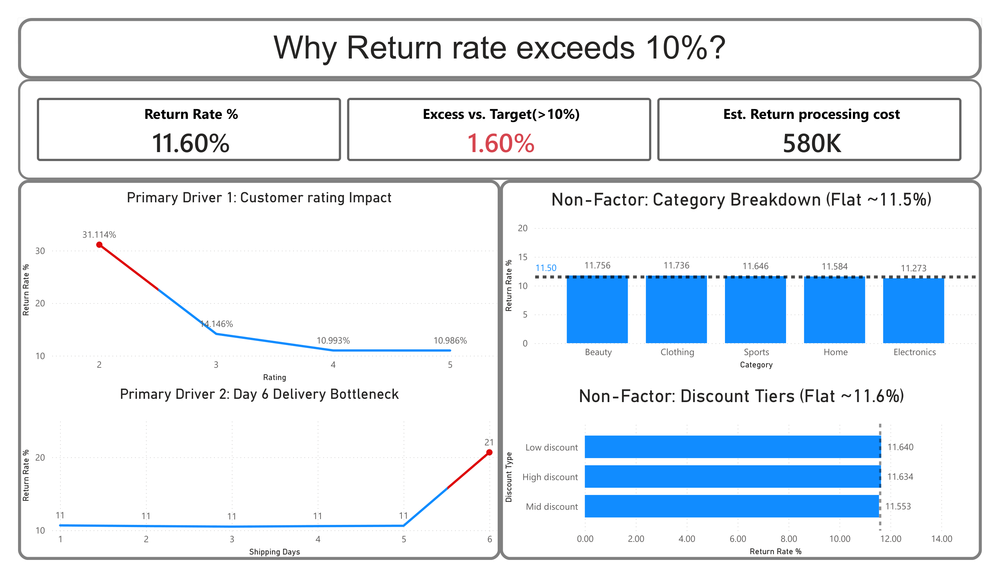

# Amazon E-Commerce Return Rate Analysis & Executive Dashboard



## Project Overview
This project presents an end-to-end data analysis and interactive Power BI dashboard investigating the root causes of excess product returns for an e-commerce platform. 

While the established operational **Service Level Agreement (SLA)** targets a maximum return rate of **10.0%**, current operations sit at **11.60%**. This **1.60% variance** generates approximately **$580K in avoidable reverse-logistics costs**, restocking overhead, and buyer friction.

---

## Key Performance Indicators (KPIs)

* **Current Return Rate:** `11.60%`
* **Target SLA Threshold:** `10.00%`
* **Excess Return Rate:** `+1.60%`
* **Estimated Processing Loss:** `$580K`

---

## Root Cause Analysis & Findings

The dataset was evaluated across product ratings, logistics timelines, product categories, and promotional discount tiers to separate actionable drivers from baseline noise.

### 1. Primary Drivers (Actionable Bottlenecks)

* **Product Quality Deficit (Rating Impact):**
  * Products rated **2 stars** exhibit an extreme **31.11% return rate**—nearly triple the target SLA.
  * Return rates stabilize once ratings reach **4 stars** (**10.99%**), confirming that low quality and inaccurate product listings directly drive buyer remorse.
* **Fulfillment SLA Breach (Day 6 Delivery Spike):**
  * Orders delivered within **1 to 5 days** maintain a healthy return rate of **~10.5%**.
  * Orders taking **6 days to deliver spike to a 20.67% return rate**, indicating that severe shipping delays cause customer dissatisfaction and pre-delivery cancellations.

### 2. Non-Factors (Baseline Uniformity)

* **Product Categories:** Return rates across **Beauty**, **Clothing**, **Sports**, **Home**, and **Electronics** sit in a narrow band between **11.27% and 11.76%**.
* **Discount Tiers:** Return rates across **Low**, **Mid**, and **High** discount tiers remain flat between **11.55% and 11.64%**.
* **Insight:** Neither product category nor discounting strategy contributes to return spikes.

---

## Key Data Summaries

### 1. Customer Rating vs. Return Rate
| Product Rating | Total Orders | Returned Orders | Return Rate (%) | Operational Status |
| :--- | :--- | :--- | :--- | :--- |
| **2 Stars** | ~100,000 | ~31,114 | **31.11%** | 🚨 Critical Quality Deficit |
| **3 Stars** | ~200,000 | ~28,292 | **14.15%** | ⚠️ Moderate Risk |
| **4 Stars** | ~350,000 | ~38,476 | **10.99%** | Normal Baseline |
| **5 Stars** | ~350,000 | ~38,451 | **10.99%** | Normal Baseline |

### 2. Shipping Time vs. Return Rate
| Shipping Time | Total Orders | Returned Orders | Return Rate (%) | Operational Status |
| :--- | :--- | :--- | :--- | :--- |
| **1 Day** | 232,944 | 24,857 | **10.67%** | Normal SLA |
| **2 Days** | 167,372 | 17,698 | **10.57%** | Normal SLA |
| **3 Days** | 166,095 | 17,440 | **10.50%** | Normal SLA |
| **4 Days** | 167,347 | 17,692 | **10.57%** | Normal SLA |
| **5 Days** | 166,424 | 17,669 | **10.62%** | Normal SLA |
| **6 Days** | 100,000 | 20,672 | **20.67%** | 🚨 SLA Breach Zone |

### 3. Category & Discount Breakdown
| Category / Tier | Return Rate (%) | Variance vs Avg | Strategic Action |
| :--- | :--- | :--- | :--- |
| **Beauty** | **11.76%** | +0.16% | No Action Required |
| **Clothing** | **11.74%** | +0.14% | No Action Required |
| **Sports** | **11.65%** | +0.05% | No Action Required |
| **Home** | **11.58%** | -0.02% | No Action Required |
| **Electronics** | **11.27%** | -0.33% | No Action Required |
| **Low Discount** | **11.64%** | +0.04% | Maintain Current Strategy |
| **High Discount**| **11.63%** | +0.03% | Maintain Current Strategy |
| **Mid Discount** | **11.55%** | -0.05% | Maintain Current Strategy |

---

## Strategic Action Plan

* **Automated Product Listing Flags:** Institute automated warnings or temporary delisting for items falling below a **3.0-star rating**.
* **Carrier SLA Enforcement:** Audit 3PL logistics partners on routes exceeding 5 days to resolve distribution bottlenecks.
* **Capital Efficiency:** Avoid spending return-mitigation budget on category-specific sizing tools or discount-structure caps, as return rates in these segments sit uniformly at baseline.

---

## Dataset

The analysis is based on the **Amazon E-Commerce** dataset provided on Kaggle:

> 📦 **[Amazon E-Commerce Dataset — sharmajicoder](https://www.kaggle.com/datasets/sharmajicoder/amazon-e-commerce)**

Download the dataset from the link above and place the CSV file in a local `dataset/` folder before opening the Power BI report.

---

## Repository Structure

```text
├── assets/
│   └── dashboard.png                   # Executive Power BI dashboard screenshot
├── Power BI Exculsive Dashboard.pbix   # Complete Power BI report file
└── README.md                           # Project documentation & summary
```
